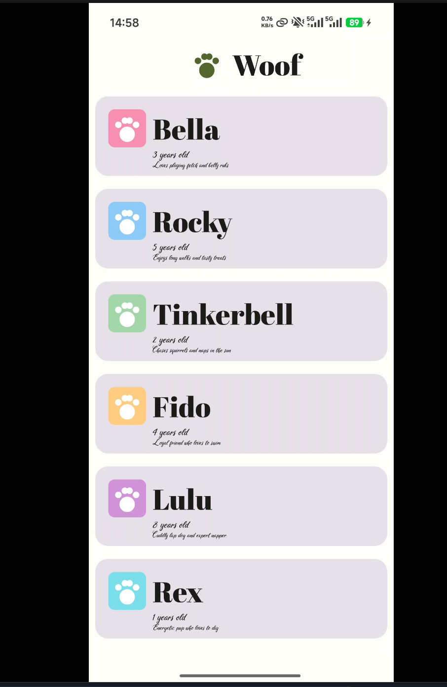

# VKU · Lập trình ứng dụng di động

**Bộ sưu tập bài thực hành Android với Jetpack Compose**

---

> Tổng hợp 4 ứng dụng Android được xây dựng từ đầu bằng **Kotlin** và **Jetpack Compose**, đi từ làm quen giao diện cơ bản đến quản lý trạng thái (state), tương tác người dùng và Material Theming.

## Danh sách bài thực hành

| Lab | Ứng dụng | Nội dung chính | Chi tiết |
|:---:|----------|----------------|----------|
| 2 | Business Card | Layout cơ bản: `Column`, `Row`, `Image`, `Icon` | [Xem chi tiết](README_LAB_2.md) |
| 3 | Dice Roller | State & sự kiện: `remember`, `mutableIntStateOf`, `Button` | [Xem chi tiết](README_LAB_3.md) |
| 4 | Tip Calculator | State hoisting, `TextField`, `Switch`, tính toán | [Xem chi tiết](README_LAB_4.md) |
| 5 | Woof | Material 3 Theming: Color Scheme, Typography, Shape, Dark Theme | [Xem chi tiết](README_LAB_5.md) |

## Video demo

### Lab 2 · Business Card

<video src="https://github.com/user-attachments/assets/b9ac1e9a-b44b-49f4-92cc-eb7eca6780f7" controls width="100%"></video>

### Lab 3 · Dice Roller

<video src="https://github.com/user-attachments/assets/8facb0d1-aefd-46f5-a906-2daeefa00906" controls width="100%"></video>

### Lab 4 · Tip Calculator

<video src="https://github.com/user-attachments/assets/ebc38e7d-d93e-4e6e-8602-26c859a67d8d" controls width="100%"></video>
### Lab 5 · Woof

<video src="https://github.com/user-attachments/assets/aad9f193-5be5-43d5-843a-2b8058e601b3" controls width="100%"></video>

## Ảnh minh họa

| Lab 2 · Business Card | Lab 3 · Dice Roller | Lab 4 · Tip Calculator | Lab 5 · Woof |
|:---------------------:|:-------------------:|:----------------------:|:------------:|
|  |  |  |  |

---

**Bắt đầu xem từ [README_LAB_2.md](README_LAB_2.md) → [README_LAB_3.md](README_LAB_3.md) → [README_LAB_4.md](README_LAB_4.md) → [README_LAB_5.md](README_LAB_5.md)**

