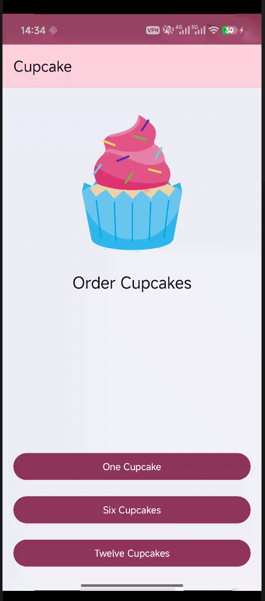

<div align="center">

# Cupcake

**Lab 6 · Android với Jetpack Compose**

[](https://kotlinlang.org)
[](https://developer.android.com/jetpack/compose)
[](https://m3.material.io)
[](https://developer.android.com)

</div>

---

> Ứng dụng **đặt bánh cupcake (Cupcake)** — luồng đặt hàng hoàn chỉnh gồm chọn số lượng, chọn hương vị, chọn ngày nhận, xem tóm tắt và chia sẻ đơn hàng, áp dụng **Jetpack Navigation Compose**, **ViewModel + StateFlow** và **kiểm thử giao diện (UI Testing)**.

---

## Video demo

<!-- Thay link bên dưới bằng video demo Lab 6 -->
<video src="https://github.com/user-attachments/assets/f46eb5ac-a99f-4f72-9ffa-5d771bdae3aa" controls width="100%"></video>

## Ảnh minh họa

<div align="center">
  <!-- Thêm ảnh chụp màn hình vào thư mục video/ với tên lab6_1.png -->
  
</div>

## Tính năng nổi bật

| Tính năng | Mô tả |
|-----------|--------|
| Chọn số lượng | Đặt 1, 6 hoặc 12 cupcake |
| Chọn hương vị | Vanilla, Chocolate, Red Velvet, Salted Caramel, Coffee |
| Chọn ngày nhận | Hôm nay và 3 ngày tiếp theo, phụ thu khi nhận trong ngày |
| Tóm tắt đơn hàng | Hiển thị số lượng, hương vị, ngày nhận và tổng tiền |
| Chia sẻ đơn hàng | Gửi chi tiết đơn hàng qua `Intent.ACTION_SEND` |
| Điều hướng | `TopAppBar` có nút Back, nút Cancel quay về màn hình đầu |

## Kiến thức áp dụng

| Khái niệm | Cách dùng |
|-----------|-----------|
| Navigation Compose | `NavHost`, `composable(route)`, `navigate()`, `popBackStack()` |
| ViewModel | `OrderViewModel` giữ state qua configuration change |
| StateFlow | `MutableStateFlow` + `collectAsState()` |
| State Hoisting | Composable nhận state + lambda thay vì tự giữ state |
| Data class | `OrderUiState` mô tả trạng thái đơn hàng |
| `RadioButton` | Chọn một trong nhiều lựa chọn |
| `rememberSaveable` | Giữ lựa chọn khi xoay màn hình |
| `NumberFormat` | Định dạng tiền tệ theo locale |
| Intent chia sẻ | `Intent.ACTION_SEND` + `createChooser` |
| UI Testing | `createAndroidComposeRule`, `TestNavHostController` |

## Cấu trúc mã nguồn

| File | Vai trò |
|------|---------|
| `MainActivity.kt` | Khởi tạo `CupcakeTheme` + `CupcakeApp` |
| `CupcakeScreen.kt` | `CupcakeScreen` (enum), `CupcakeAppBar`, `CupcakeApp` (NavHost) |
| `data/DataSource.kt` | Danh sách hương vị và số lượng |
| `data/OrderUiState.kt` | Data class trạng thái đơn hàng |
| `ui/OrderViewModel.kt` | Tính giá tiền và quản lý state |
| `ui/StartOrderScreen.kt` | Màn hình chọn số lượng |
| `ui/SelectOptionScreen.kt` | Màn hình chọn hương vị / ngày nhận (dùng chung) |
| `ui/SummaryScreen.kt` | Màn hình tóm tắt đơn hàng |
| `ui/components/CommonUi.kt` | `FormattedPriceLabel` |
| `ui/theme/*` | Theme: `Color`, `Theme`, `Type` |

## Kiểm thử giao diện (UI Testing)

Bộ test nằm trong `app/src/androidTest/java/com/example/cupcake/test/`:

| File | Vai trò |
|------|---------|
| `CupcakeScreenNavigationTest.kt` | Kiểm thử luồng điều hướng giữa các màn hình |
| `CupcakeOrderScreenTest.kt` | Kiểm thử nội dung màn hình Start / Select Option / Summary |
| `ScreenAssertions.kt` | Helper assert route hiện tại của `NavController` |
| `ComposeRuleExtensions.kt` | Helper tìm node theo string resource id |

```bash
./gradlew connectedAndroidTest   # Chạy toàn bộ UI test trên thiết bị
```

## Chạy dự án

```bash
cd "Lab 6. Cupcake app"
./gradlew assembleDebug      # Build APK
./gradlew installDebug       # Cài lên thiết bị qua adb
```

**Mã nguồn chính:** [`src/main/java/com/example/cupcake/MainActivity.kt`](Lab%206.%20Cupcake%20app/src/main/java/com/example/cupcake/MainActivity.kt)

<div align="center">

[← Lab 5 · Woof](README_LAB_5.md) · [Về trang chủ](README.md)

</div>
